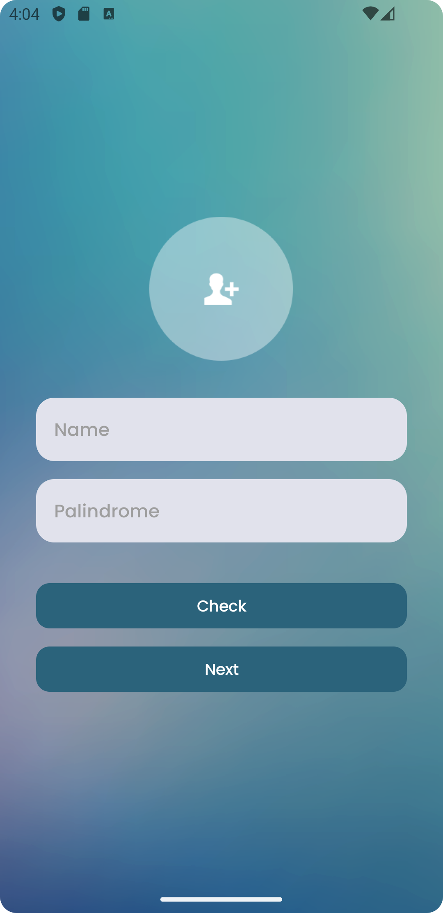
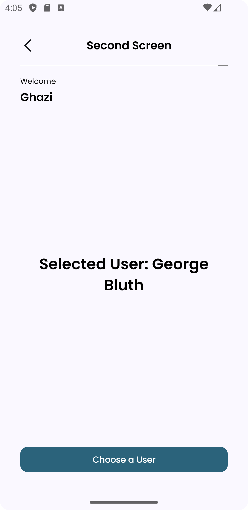
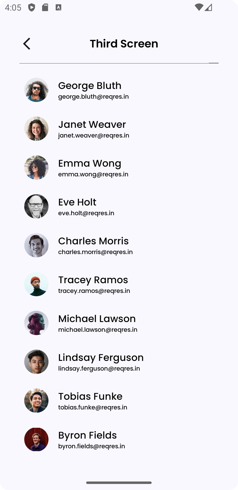
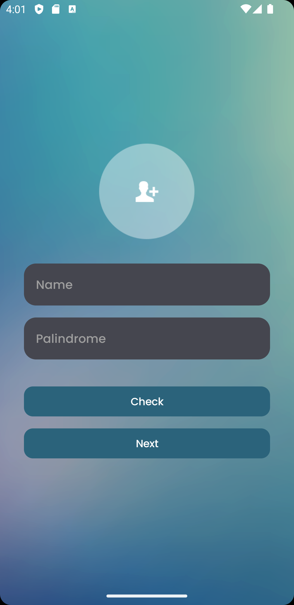
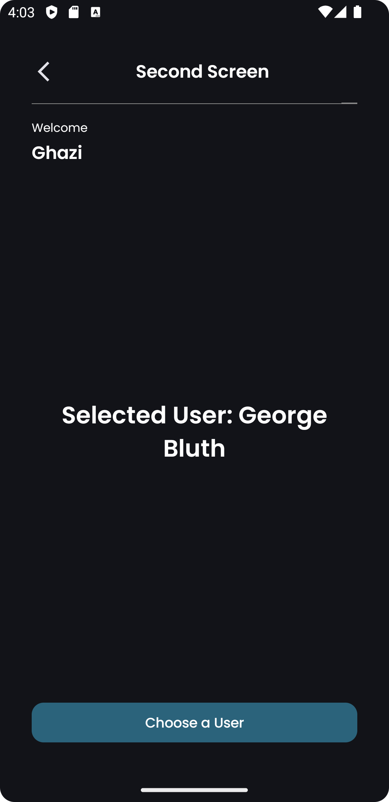
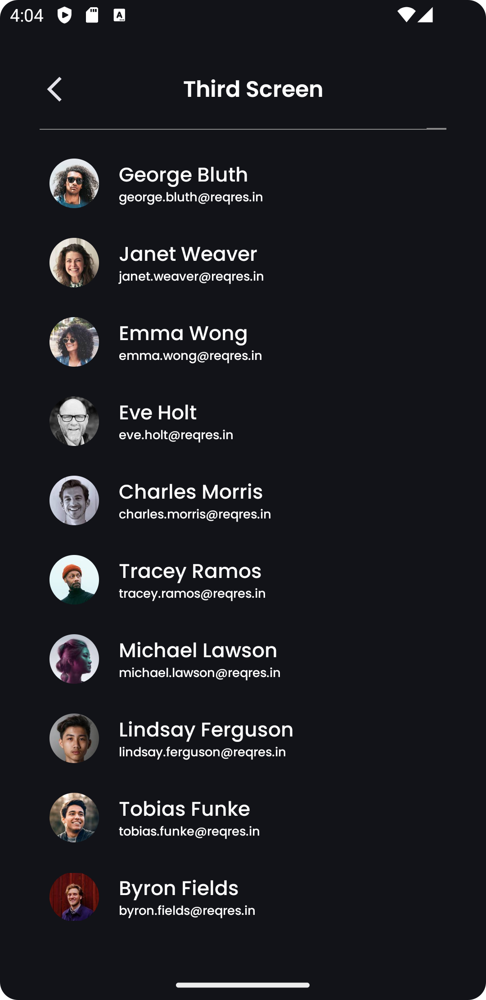

# Suitmedia Mobile Intern Test 2024 - Ghazi Akmal Fauzan

## Overview

This mobile application is developed for Android using Kotlin with Jetpack Compose. It includes three main screens and features for user interaction and dynamic content display.

## Screenshots

### Light Mode

<p align="center">
  
  
  
</p>

### Dark Mode

<p align="center">
  
  
  
</p>

## Features

1. **FirstScreen**
   - Checks if a string is a palindrome.
   - Provides navigation to the `SecondScreen`.

2. **SecondScreen**
   - Displays a welcome message.
   - Provides navigation to the `ThirdScreen`.

3. **ThirdScreen**
   - Shows a list of users fetched from an API.
   - Supports pagination and pull-to-refresh functionality.

4. **Top Bar**
   - Consistent top bar design for `SecondScreen` and `ThirdScreen`.

## Requirements

- **Android SDK**
  - Minimum SDK: 21
  - Target SDK: 34

## Setup

### Prerequisites

- Android Studio
- Internet to access API

### Installation

1. **Clone the Repository**

   ```bash
   git clone https://github.com/ghaziakmalf/Suitmedia-Mobile-Test-2024.git
   ```

2. **Open the Project in Android Studio**

   - Open Android Studio.
   - Select "Open an Existing Project".
   - Navigate to the project directory and open it.

3. **Add Dependencies**

   - Ensure all dependencies are included in your `build.gradle` files.
   - Sync the project with Gradle files.

### Running the Application

- Connect your Android device or start an emulator.
- Click "Run" in Android Studio.

## APK Distribution

The APK file for this project is available for download in the root directory of this repository. You can download it directly from the following link:

[Download APK](https://github.com/ghaziakmalf/Suitmedia-Mobile-Test-2024/raw/main/Ghazi_SuitmediaInternMobileApp2024.apk)

Note: Ensure that you have enabled the installation of apps from unknown sources on your device to install the APK.

## License

This project is licensed under the MIT License - see the [LICENSE](LICENSE) file for details.

## Contact

- **Ghazi Akmal Fauzan** - ghaziakmalf@gmail.com - [LinkedIn](https://www.linkedin.com/in/ghazi-akmal-fauzan/)
